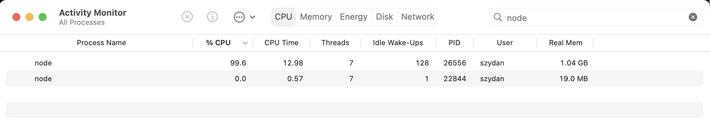

# Character counter - program memory consumption
 
Let's write a program that's a bit more complex. 
The program will open a text file, read it's content and count the number each letter occurs in the file.
At the end the program will print a table with all the letters it found, 
there  will be a number next to each letter of how many times that letter occurred.

### First implementation - memory consumption grows with the size of an input file

```js
const fs = require('fs');

if (process.argv.length !== 3) {
  console.log('Usage: node character-counter.js FILEPATH');
  process.exit(1);
}

function updateLetterCount(letterCount, letters) {
	for (const letter of letters) {
	  if (letterCount[letter]) {
	    letterCount[letter]++;
	  } else {
	    letterCount[letter] = 1;
	  }
	}
}

function printResults(letterCount) {
	let orderedLetters = Object.keys(letterCount).sort()
	for (const letter of orderedLetters) {
	    console.log(letter + ":" + letterCount[letter])
	}
}

const fileName = process.argv[2];
const text = fs.readFileSync(fileName, 'utf8');

//Introduce and object (map) to keep the results
const letterCount = {};

// Split text into array of letters
const letters = text.split('');


// Iterate over the array of letters and count them 
updateLetterCount(letterCount, letters)

// print the results in alphabetical order
printResults(letterCount)
```

To execute the program, type:

```sh
node character-count-1.js sample.txt
```

Here are the results:

```
node  character-counter-1.js sample.txt 
	:192

:1970943
 :15975065
!:65581
":399570
#:11586
$:1757
...
```

### Improvements 

The program above could be further improved
Here are a few things we could do: 

* print the letter statistics in a better way, for example, as a graph
* exclude special characters if we do not want to count them 
* save the results to a file 
* normalize the output numbers to a range from 0 to 1

The improvements above would be nice, however our program has one issue which is more important to address. 
What if we want to compute letter statistics for a very big file which contains millions or even billions of characters.

Then this line can be a problem

```js
const text = fs.readFileSync(fileName, 'utf8');
```

It'll tell the computer to load the entire file into a variable text (memory).
When the file is small (a few hundred characters) our program will use very little memory, 
only a few hundred bytes.
However if the file is huge it will use a large amount of memory. 

To fix this we will use another method of reading files (stream).
Stream in computer programming refers to a data that is continuously flowing from source to a destination. 
When we use a stream to read a file we do not load the whole file into memory at once,
instead we read it in small chunks, one chunk at any given time. 
This way our program will only use a small amount of memory at any given time regardless of how big the input file is.


### Second implementation using streams - bounded memory consumption

```js
const fs = require('fs');

if (process.argv.length === 3) {
    console.log('Usage: node character-counter.js FILEPATH');
    process.exit(1);
}
const fileName = process.argv[2];


function updateLetterCount(letterCount, chunk) {
	const letters = chunk.toString().split('');
  // Iterate over the array of letters and count them 
	for (const letter of letters) {
	  if (letterCount[letter]) {
	    letterCount[letter]++;
	  } else {
	    letterCount[letter] = 1;
	  }
	}
}

function printResults(letterCount) {
	let orderedLetters = Object.keys(letterCount).sort()
	for (const letter of orderedLetters) {
	    console.log(letter + ":" + letterCount[letter])
	}
}

//Introduce and object to keep results
const letterCount = {};

const options = { bufferSize: 32 * 1024 };
const readableStream = fs.createReadStream(filePath, options);

readableStream.on('error', function (error) {
    console.log(`error: ${error.message}`);
});

readableStream.on('data', (chunk) => {
  updateLetterCount(letterCount, letters)
});

readableStream.on('end', (chunk) => {
  if (chunk) {
    updateLetterCount(letterCount, letters)
  }	
  // print the results in alphabetical order
  printResults(letterCount)
});
``` 

Note these lines
The second parameter (called options) passed to createReadStream is telling how much memory 
our program can use when reading the data from the file.
In this case we are telling it to use only 32kB (kilo bytes)
Now even if we tell it to read a 1 GB (giga byte) file the stream will load in memory only up to 32 kb 
and then wait until some of it is processed before loading more.

```js
const options = { bufferSize: 32 * 1024 };
const readableStream = fs.createReadStream(filePath, options);
```

To run it  

```sh
node character-count-2.js sample.txt  
```

And we get the same results 

```
node  character-counter-1.js sample.txt 
	:192

:1970943
 :15975065
!:65581
":399570
#:11586
$:1757
...
```

### How to test 

Lets prove that the memory consumption of the two programs is very different 
Open the activity/process monitor and put `node` in the search bar.

 

Now execute each version of the program while looking at the memory column
You will notice that version 1 is consuming way more memory.

```sh
node character-count-1.js sample.txt  
node character-count-2.js sample.txt  
```


