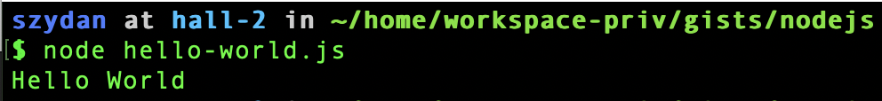
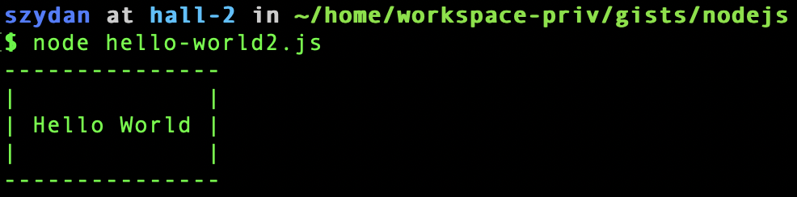

# Hello world 

The first program in any new language is called a hello world program.
Hello world program prints "Hello World" text on the screen.

Below is an example in nodejs

```js
console.log("Hello World")
```

To run it we have to first create a file called hello-world.js (the name of the file does not matter) and add the above line and save it.
Then to execute it we will use the nodejs environment from our shell.

Assuming 

* you have nodejs installed. If not see how to do it [here](../setup/nodejs.md)
* you have a file called hello-world.js 

Type `node hello-world.js` in your terminal and hit enter
You should see a "Hello world" printed on your screen.



### What has happened  

In our first program we

* used a built-in global object called `console`
* this object has a few methods and we use one called `log`
* we passed one parameter to the method. This parameter was the text "Hello World"
* the `log` method 'took' our parameter and printed (logged) it on the screen

### Another example

Let's do another example and print something more on the screen 
This time lets print a text "Hello World" in a box. We will make the box sides using "|" and "-" characters. Let's create a new file called hello-world2.js and save the following lines in it.

```js
console.log("---------------")
console.log("|             |")
console.log("| Hello World |")
console.log("|             |")
console.log("---------------")
```

Now type 

```
node hello-world2.js
```


