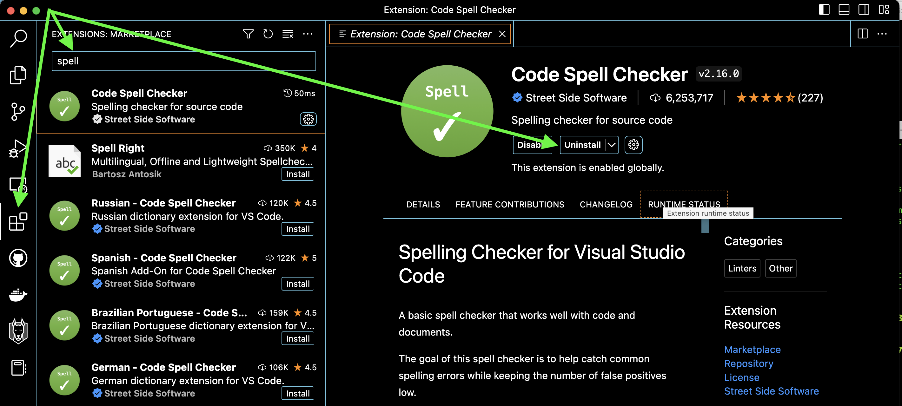

# Setting up your editor (IDE)

IDE short for Integrated Development Environment is much more than just a text editor.
These days it will come with all you need for your work

* text editor
* debugger
* console
* plugins

When you are just starting to program you only need a simple text editor.
However the more you want to do the the more tools you will need and here an IDE comes handy.

These days one of the most popular ones is VSCode, and all the examples in this gists will use it.
It is free and can be installed from [here](https://code.visualstudio.com/) 

### Things good to do before you start using it 


#### Configure a command line shortcut  

Make sure that you configure your shell to have a nice alias to open the editor 
On another operating system we might need to do it differently or it could already be working after the installation

Go to your project main folder and type

```
code .
```

If the editor opens and shows you files from the current folder everything is good.

If it doesn't work, out of the box, you need to add VSCode executable to your PATH environmental variable.
On OSX it would be adding a similar line to your `.zshrc` or `.bashrc` or similar files for other shells. 

```
export PATH="/Applications/Visual Studio Code.app/Contents/Resources/app/bin:$PATH"
```

#### Disable telemetry

Another thing you might want to do is to disable the telemetry, if you do not want to send usage information back to Microsoft

For MacOSx

```
Code > Preferences > Settings
search for telemetry , and set the Telemetry: Telemetry Level setting to off
```

For Linux

```
From File > Preferences > Settings
search for telemetry , and set the Telemetry: Telemetry Level setting to off
```

#### Add first plugin 

You'll need a few, but the best one to install first would be a spellchecker. 
Click Extensions on the left vertical menu
Search for `spell` there are quite a few to select from
Select the one you want and click install 

