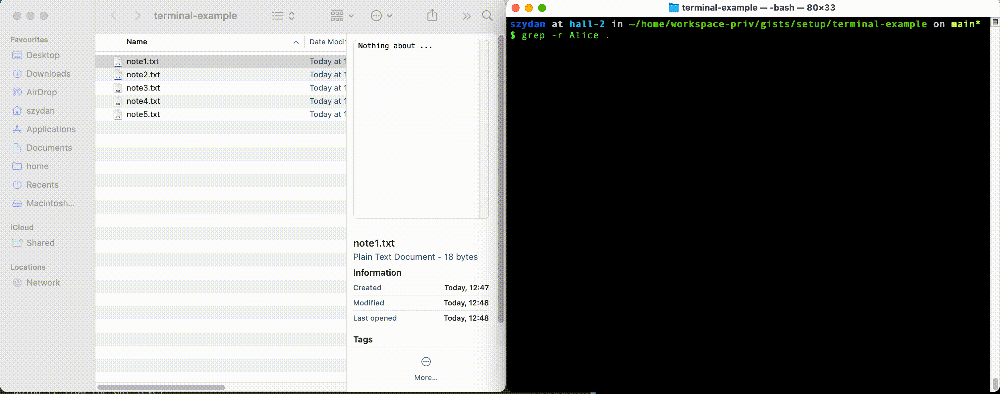

# Why terminal 

Majority of people when they first start to use the computers they do it through the GUI (Graphical user interface). They do it by clicking or touching things on the screen. 
This is the best way of interacting with computers today, maybe in near future we will use voice more and more, however this is not always the fastest way of doing things on the computer.

For programmers the best way is to do things from terminal level. 
There is couple of reasons for it, for example:

* common operations on files is much faster when you do it from terminal, as quite often few commands on the terminal can do as much as thousand clicks on the screen
* doing things on terminal force you to understand how things work on the lower level, quite often GUIs are using a subset of command line options. When you know how to use things from the command line you can do more complicated operations which are not supported from GUI level
* It looks cool when your friends are looking over your shoulder ;-)

### Speed

Let's use simple example to demonstrate the difference in speed 
Imagen you have a folder in which you keep your notes, maybe 10 files with just few lines of text in each. Now you remember that in one of the notes you wrote something about your friend Alice and now you want to find this file out

Below a comparison how one might do it using GUI and terminal 
On the left user clicks through every file and look at the preview to see if there is anything about Alice (here we assume the notes are short and the full content would fit into the preview box)
On the right user is doing the same opertion using the terminal and the command `grep`  

You see that was only 5 files, now imagen if you have to search through a hundred files or a thousand files. The sample directory with notes files can be found [here](terminal-e)
### Some of the often used terminal commands 

* `ls` - to list the content of the folder
* `mkdir` - to make new folder
* `cp` - to copy files
* `rm` - to delete files and folders
* ...

